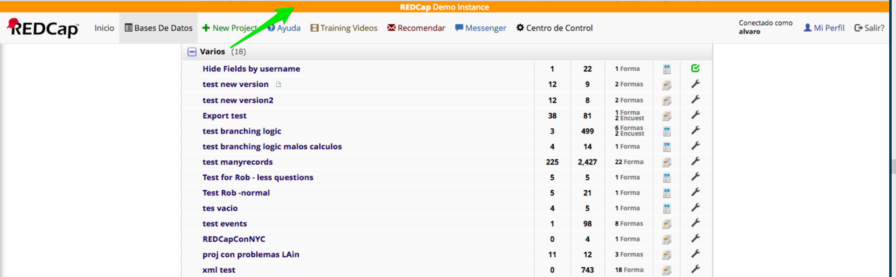
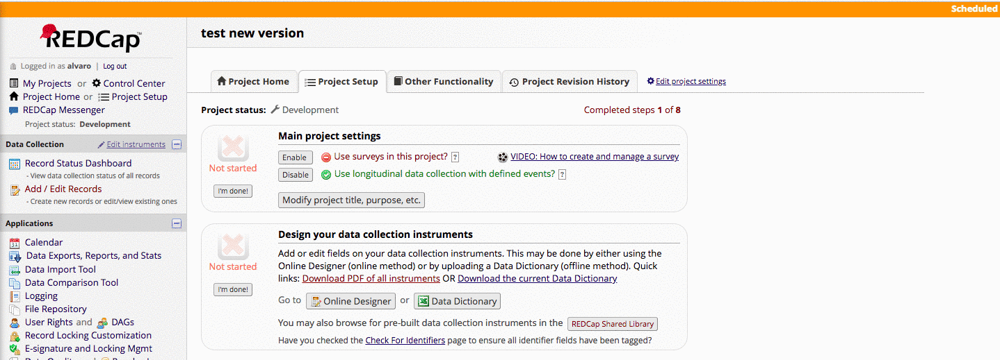

 
# REDCap Single line System Informational Text
 

 Single line Informational System text to display at top of all pages,  Used to distinguish between Demo, Test and UAT REDCap installations, announce maintenance time, etc.
 
 #### Options
 
   * To see the message also on Projects Enable module on all projects by default on the Module Configuration. 
   * To Exclude from surveys use checkbox 
   * Change Background color
   * Change Text color
   * To add movement to the text use the ```<MARQUEE></MARQUEE>  ```
 
 ***Message Examples:***
  
   ```
 * <center><b>REDCap</b> Demo Instance </center> 
 * <MARQUEE><center><b>REDCap</b> Demo Instance</center></MARQUEE>
 * <MARQUEE><b>Scheduled Down Time</b> Server upgrades will be attempted Monday morning,<u> July 9th, between 7-8AM.</u> We anticipate minimal interruption. We apologize for any inconvenience.</MARQUEE>
 ```
 
 
 
 
**MARQUEE**

 